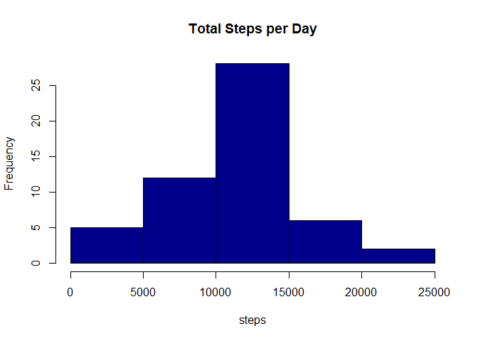
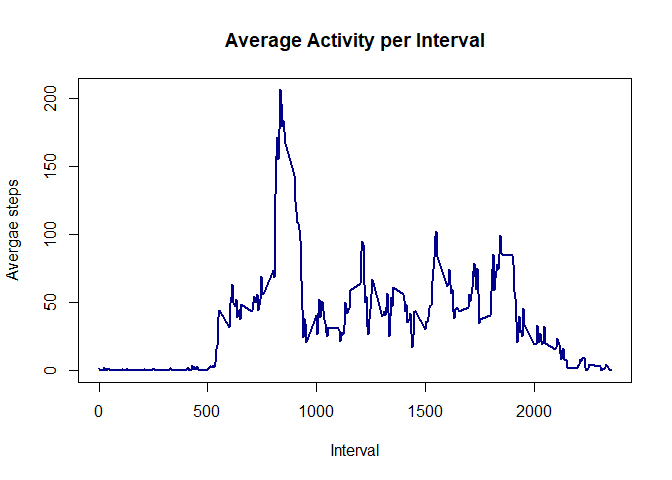
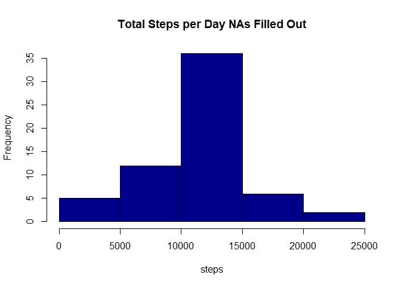
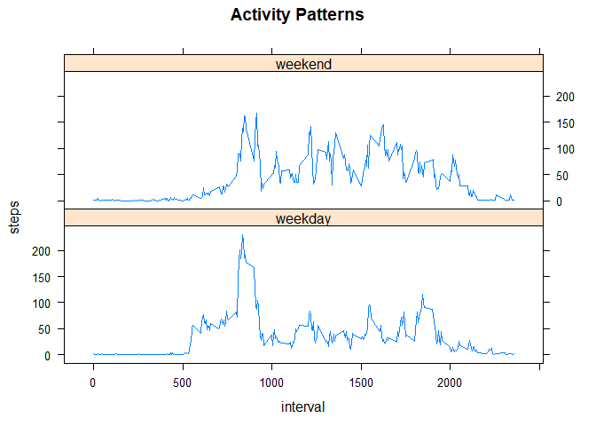

### **Loading and preprocessing the data**

```r
 library(readr)
 activity <- read_csv("~/R/Curso/RepData_PeerAssessment1/activity.zip",  col_types = cols(steps = col_double()))
 head(activity)
```

```
## # A tibble: 6 x 3
##   steps date       interval
##   <dbl> <date>        <dbl>
## 1    NA 2012-10-01        0
## 2    NA 2012-10-01        5
## 3    NA 2012-10-01       10
## 4    NA 2012-10-01       15
## 5    NA 2012-10-01       20
## 6    NA 2012-10-01       25
```


```r
 summary(activity)
```

```
##      steps             date               interval     
##  Min.   :  0.00   Min.   :2012-10-01   Min.   :   0.0  
##  1st Qu.:  0.00   1st Qu.:2012-10-16   1st Qu.: 588.8  
##  Median :  0.00   Median :2012-10-31   Median :1177.5  
##  Mean   : 37.38   Mean   :2012-10-31   Mean   :1177.5  
##  3rd Qu.: 12.00   3rd Qu.:2012-11-15   3rd Qu.:1766.2  
##  Max.   :806.00   Max.   :2012-11-30   Max.   :2355.0  
##  NA's   :2304
```

### **What is mean total number of steps taken per day?**

1. Calculate the total number of steps taken per day. create new data frame with total steps per day.


```r
new_df <- aggregate(activity[c("steps")], FUN=sum, by=list(d=as.POSIXct(trunc(activity$date, "day"))))
head(new_df)
```

```
##                     d steps
## 1 2012-10-01 02:00:00    NA
## 2 2012-10-02 02:00:00   126
## 3 2012-10-03 02:00:00 11352
## 4 2012-10-04 02:00:00 12116
## 5 2012-10-05 02:00:00 13294
## 6 2012-10-06 02:00:00 15420
```

2. Make a histogram of the total number of steps taken each day

```r
hist(new_df$steps, breaks=5, main="Total Steps per Day", col="darkblue", xlab="steps")
```

<!-- -->

3. Calculate and report the mean and median of the total number of steps taken per day.

What is mean total number of steps taken per day ignoring NAs?

```r
mean <- mean(new_df$steps, na.rm = TRUE)
print(mean)
```

```
## [1] 10766.19
```

What is median total number of steps taken per day ignoring NAs?

```r
median <- median(new_df$steps, na.rm = TRUE)
print(median)
```

```
## [1] 10765
```

The mean number of steps taken per day is 1.076619\times 10^{4} and the median is 1.0765\times 10^{4}.

## **What is the average daily activity pattern?**

1. Make a time series plot of the 5-minute interval (x-axis) and the average number of steps taken, averaged across all days (y-axis)

To do this, we need a table with the average steps per interval, removing NAs:

```r
interval_means <- aggregate(activity$steps, by=list(activity$interval), FUN=mean, na.rm=TRUE)
colnames(interval_means) <- c("Interval", "Average_Steps")
head(interval_means)
```

```
##   Interval Average_Steps
## 1        0     1.7169811
## 2        5     0.3396226
## 3       10     0.1320755
## 4       15     0.1509434
## 5       20     0.0754717
## 6       25     2.0943396
```


Plot time series 

```r
plot(interval_means$Interval, interval_means$Average_Steps, type="l", main="Average Activity per Interval", xlab="Interval", ylab = "Avergae steps", col="darkblue", lwd=2)
```

<!-- -->


2. Which 5-minute interval, on average across all the days in the dataset, contains the maximum number of steps?

```r
interval_means[which.max(interval_means$Average_Steps),1]
```

```
## [1] 835
```

The interval with the maximun average number of steps is 835 or 8:35 am. 

## **Imputing missing values**

1. Calculate and report the total number of missing values in the dataset (i.e. the total number of rows with NAs)

```r
sum(is.na(activity))
```

```
## [1] 2304
```
There are 2,304 missing values out of 17,568 observations

2. Devise a strategy for filling in all of the missing values in the dataset. 

For this, we will replace missing values with the mean of the interval.

3. Create a new dataset that is equal to the original dataset but with the missing data filled in.

```r
activity_no_NAs <- activity #copy original data frame
```
create a function to subsitute NAs with average steps for the interval and save output to a new variable


```r
   steps_no_NAs <- numeric()
  for(i in 1:nrow(activity)) {
    x <- activity[i,]
    if (is.na(x$steps)) {
      steps <- subset(interval_means,Interval==x$interval)$Average_Steps
    } else {
      steps <- x$steps
    }
    steps_no_NAs <- c(steps_no_NAs,steps)
  }    
```

We can now fill out the steps with the new values


```r
activity_no_NAs$steps <- steps_no_NAs
```

New dataframe with no missing values


```r
head(activity_no_NAs)
```

```
## # A tibble: 6 x 3
##    steps date       interval
##    <dbl> <date>        <dbl>
## 1 1.72   2012-10-01        0
## 2 0.340  2012-10-01        5
## 3 0.132  2012-10-01       10
## 4 0.151  2012-10-01       15
## 5 0.0755 2012-10-01       20
## 6 2.09   2012-10-01       25
```

4. Make a histogram of the total number of steps taken each day and Calculate and report the mean and median total number of steps taken per day. 


```r
new_daily_df_no_NAs <- aggregate(activity_no_NAs[c("steps")], FUN=sum, by=list(d=as.POSIXct(trunc(activity_no_NAs$date, "day"))))
```


```r
hist(new_daily_df_no_NAs$steps, breaks=5, main="Total Steps per Day NAs Filled Out", col="darkblue", xlab="steps")
```

<!-- -->


```r
# mean
new_mean<- mean(new_daily_df_no_NAs$steps)
```


```r
# mean
new_median <- median(new_daily_df_no_NAs$steps)
```


The new mean and median are the same now 1.0766189\times 10^{4}. The median increased by 1.8867.


## **Are there differences in activity patterns between weekdays and weekends?**

1. Create a new factor variable in the dataset with two levels – “weekday” and “weekend” indicating whether a given date is a weekday or weekend day.


```r
activity_no_NAs$weekday <- NA # create new column
#and fill it in 
activity_no_NAs$weekday <- ifelse(weekdays(activity_no_NAs$date) %in% c("Saturday", "Sunday"), "weekend", "weekday")  
dplyr::sample_n(activity_no_NAs, 5)
```

```
## # A tibble: 5 x 4
##   steps date       interval weekday
##   <dbl> <date>        <dbl> <chr>  
## 1     0 2012-11-13     1010 weekday
## 2     0 2012-10-25     1420 weekday
## 3     0 2012-11-03     2035 weekend
## 4     0 2012-10-27     1340 weekend
## 5     0 2012-11-21     2220 weekday
```

2. Make a panel plot containing a time series plot  of the 5-minute interval (x-axis) and the average number of steps taken, averaged across all weekday days or weekend days (y-axis). 

first, we have to calculate the average steps across the intervals in the weekdays and weekends

```r
interval_weekdays <- dplyr::filter(activity_no_NAs, weekday=="weekday")
interval_means_weekdays <- aggregate(interval_weekdays$steps, by=list(interval_weekdays$interval), FUN=mean)
colnames(interval_means_weekdays) <- c("interval", "steps")
interval_means_weekdays$weekday <- "weekday"

interval_weekends <- dplyr::filter(activity_no_NAs, weekday=="weekend")
interval_means_weekends <- aggregate(interval_weekends$steps, by=list(interval_weekends$interval), FUN=mean)
colnames(interval_means_weekends) <- c("interval", "steps")
interval_means_weekends$weekday <- "weekend"

# get dfs together
intervals_weekday_weekend <- rbind(interval_means_weekdays, interval_means_weekends)
```

we can now plot the time series


```r
library(lattice)
xyplot(steps ~ interval| weekday, data= intervals_weekday_weekend, layout=c(1,2),type="l", main="Activity Patterns")
```

<!-- -->

